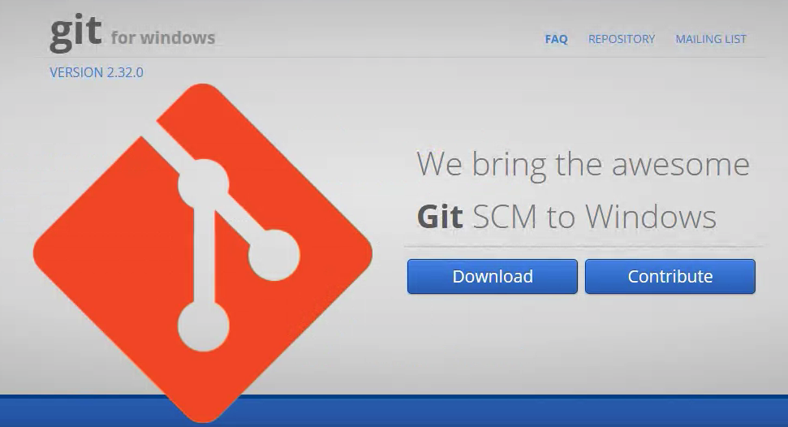
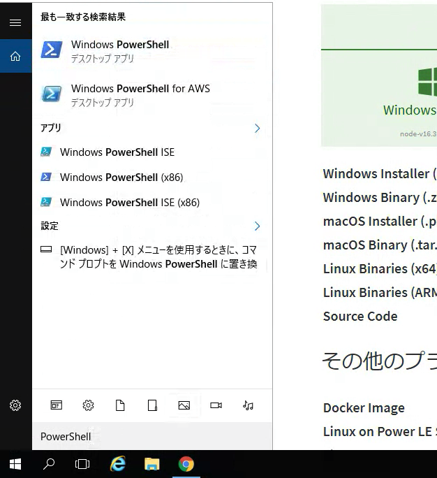
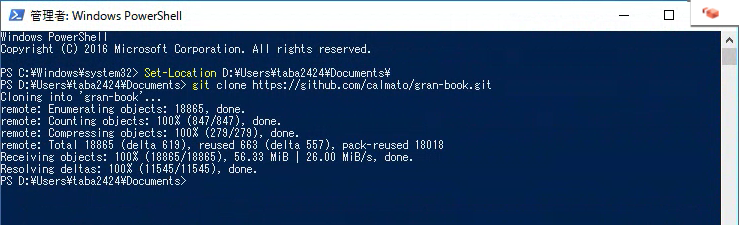
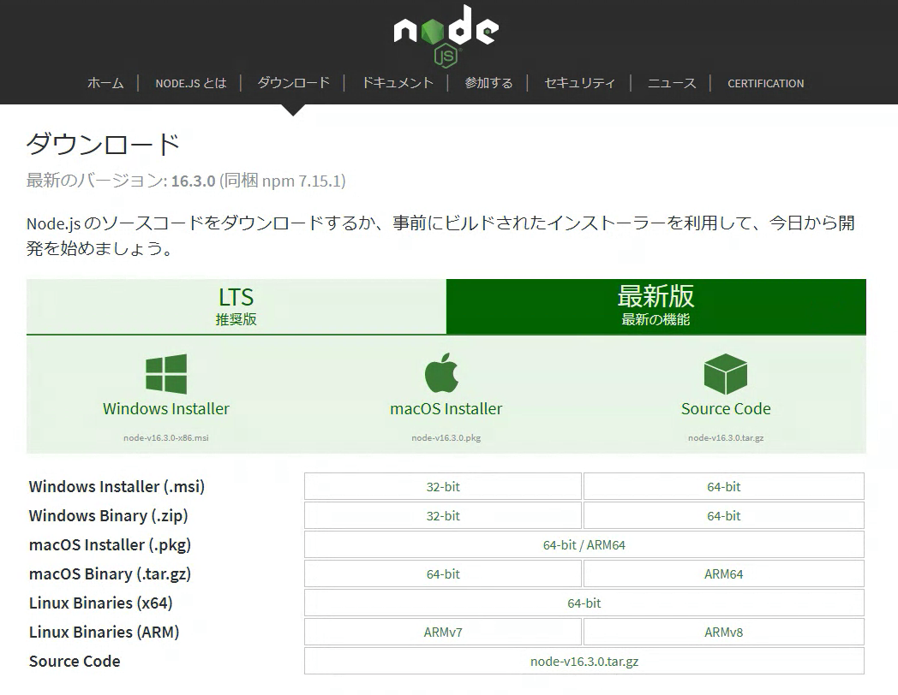
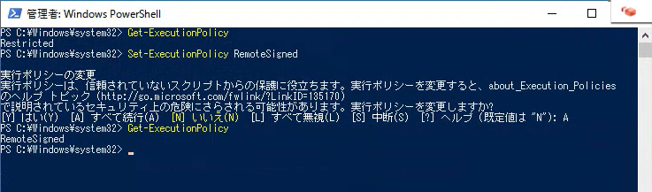
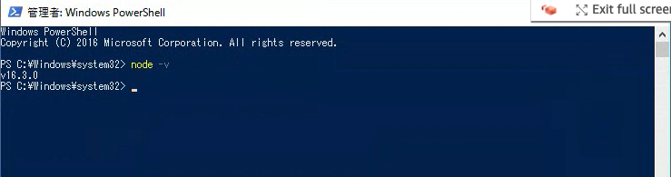
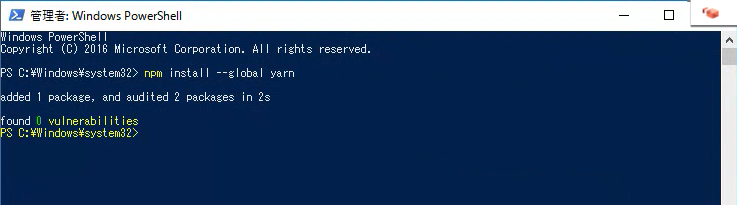
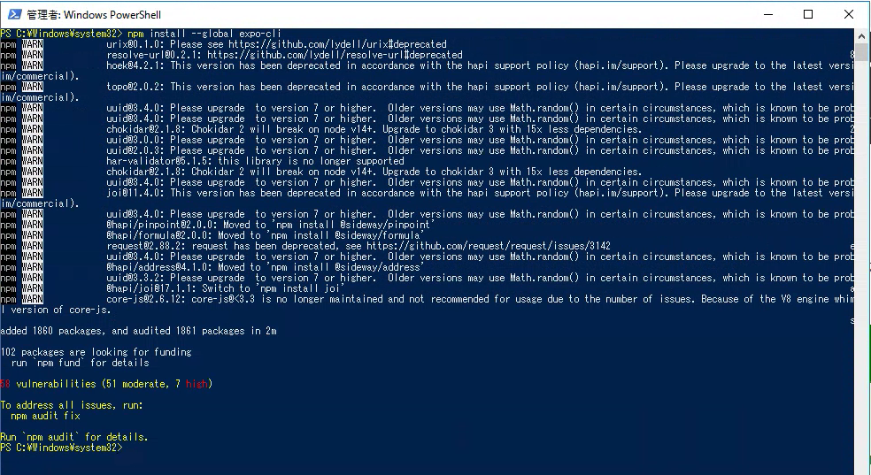
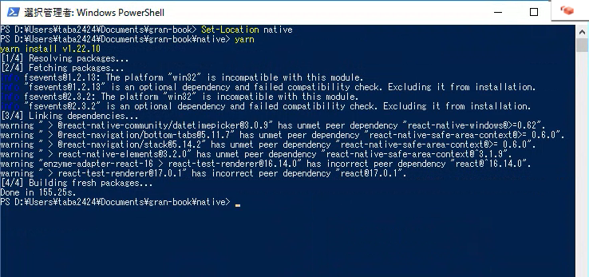
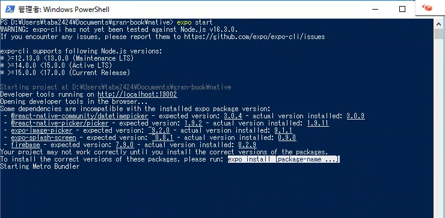

# 環境構築 - Windows

[root](./../../README.md) 
/ [03_setup](./README.md) 
/ [Windows - 環境構築](./setup-windows.md)

## Windows 10の環境構築手順

### 動作確認

| item  |         detail          |
| :---- | :---------------------- |
| OS    | Windows 10 (Japanese)   |
| CPU   | 2vCPU                   |
| MEM   | 4GB                     |
| Disk  | C: 80GB, D: 50GB        |
| Infra | AWS (Amazon Workspaces) |

### 概要

1. GitHubリポジトリのクローン
2. ネイティブアプリ起動設定
3. コンテナ実行環境の設定

### GitHubリポジトリのクローン

1. Gitのインストール
    1. 下記URLへアクセス
        > https://gitforwindows.org/
    2. 画面中央の `ダウンロード` をクリックし、インストーラをダウンロード
        
    3. インストーラを起動し、画面表示に従いインストールを進める (基本的にはデフォルトのままでOK)

2. Gitがインストールできていることの確認
    1. 画面下の検索バーより、 `Windows PowerShell` を検索。右クリックし、 `管理者として実行` をクリック
        
    2. 以下コマンドを実行し、Gitのバージョン情報が表示されることを確認

3. GitHubリポジトリをクローン
    1. リポジトリをクローンするディレクトリに移動
    2. 以下コマンドを実行し、リポジトリをクローンする
        > $ git clone https://github.com/calmato/gran-book.git

        

### ネイティブアプリ起動設定

1. Node.jsのインストール
    1. 下記URLより、公式HPへアクセス
        > https://nodejs.org/ja/
    2. 画面上部の `ダウンロード` タブをクリック
    3. `最新版 最新の機能` タブの `Windows Installer (.msi): 64-bit` をクリックし、インストーラをダウンロード
        
    4. インストーラを起動し、画面表示に従いインストールを進める (基本的にはデフォルトのままでOK)

2. Expo CLIのインストール
    1. Windows PowerShellを管理者として起動する
    2. 以下コマンドを実行し、PowerShellの実行ポリシーを確認
        > $ Get-ExecutionPolicy
    3. (2) で `Restricted` と表示された場合、以下コマンドを実行し、実行ポリシーを変更
        > $ Set-ExecutionPolicy RemoteSigned

        
    4. 以下コマンドを実行し、Node.jsのバージョン情報が表示されることを確認
        > $ node -v

        
    5. 以下コマンドを実行し、yarnをインストール
        > $ npm install --global yarn

        
    6. 以下コマンドを実行し、Expo CLIをインストール
        > $ npm install --global expo-cli

        

3. ネイティブアプリの起動検証
    1. GitHubリポジトリをクローンしたディレクトリに移動
    2. nativeディレクトリへ移動
    3. 以下コマンドを実行し、起動に必要なライブラリをインストール
        > $ yarn

        
    4. 以下コマンドを実行し、Expoを起動
        > $ expo start

        

### コンテナ実行環境の設定

* 動作確認している環境 (Amazon Workspaces) では対応してないので、手順をまとめるのは諦める

---

## 参考

* [Qiita - Windows 10へNode.jsをインストールする](https://qiita.com/echolimitless/items/83f8658cf855de04b9ce)
* [Zenn - Expo環境構築](https://zenn.dev/soiree/articles/sample-article)
* [PowerShell スクリプト実行権限の変更](https://labor.ewigleere.net/2020/06/04/yarn-powershell/)
