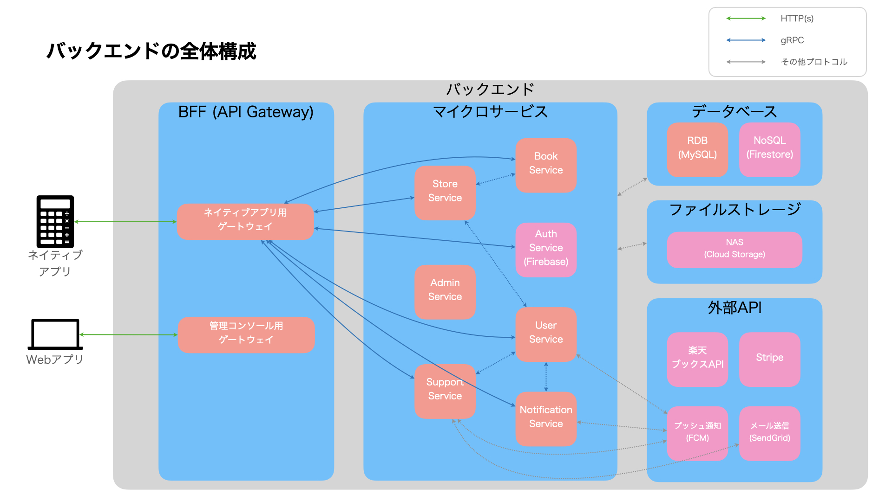

# バックエンド - 設計

[root](./../../../README.md) 
/ [12_backend](./../README.md) 
/ [01_design](./README.md)

# 各種ドキュメント

* [API設計 - ドメイン・URL設計](./domain-url.md)
* [API設計 - リクエスト・レスポンス設計](./request-response.md)
* [Golang - ディレクトリ構成](./directories-for-golang.md)
* [Node.js - ディレクトリ構成](./directories-for-node.md)

## 内部API

* APIとしては以下に分割
  * [認証用API](./../31_auth_api/README.md)
  * [ユーザ管理用API](./../32_user_api/README.md)
  * [書籍管理用API](./../33_book_api/README.md)
  * [ECサイト用API](./../34_store_api/README.md)
  * [サポート用API](./../35_information_api/README.md)

---

## 外部API

* 以下のサービスを採用
  * 書籍検索関連のAPI
    * [Google Books API](./../31_google_books_api/README.md)
  * 支払い関連のAPI
    * [Stripe](./../32_stripe/README.md)

* その他検討対象のサービス
  * 書籍検索関連のAPI
    * Amazon Advertising API
    * 楽天Book API
  * 支払い関連のAPI
    * PayPal
