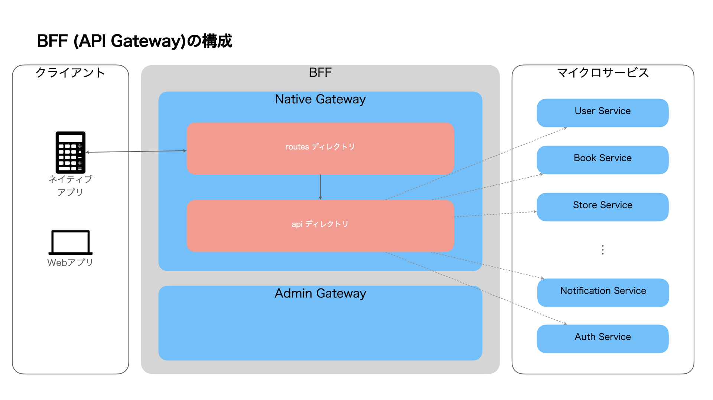

# Golang - ディレクトリ構成

[root](./../../../README.md) 
/ [12_backend](./../README.md) 
/ [01_design](./README.md) 
/ [ディレクトリ構成](./directories-for-node.md) 

## ディレクトリ構成

<pre>
.
└── src
    ├── api
    ├── config
    ├── lib
    ├── plugins
    ├── routes
    └── types
        ├── input
        ├── output
        ├── request
        └── response
</pre>

| ディレクトリ名 |                                              説明                                              |
| :------------- | :--------------------------------------------------------------------------------------------- |
| api            | マイクロサービスへの接続関連の処理を実装                                                       |
| config         | システムの設定ファイルを配置                                                                   |
| lib            | ミドルウェア等の実装                                                                           |
| plugins        | ライブラリ設定の実装                                                                           |
| proto          | gRPC関連の定義ファイルの配置                                                                   |
| routes         | クライアント<->マイクロサービス間のデータ変換処理を実装 REST APIのルーティング定義もここで |
| types          | システム内で使用するオブジェクトの型定義                                                       |
| types/input    | マイクロサービスへのリクエストの型定義                                                         |
| types/output   | マイクロサービスからのレスポンスの型定義                                                       |
| types/request  | クライアントからのリクエストの型定義                                                           |
| types/response | クライアントへのレスポンスの型定義                                                             |

