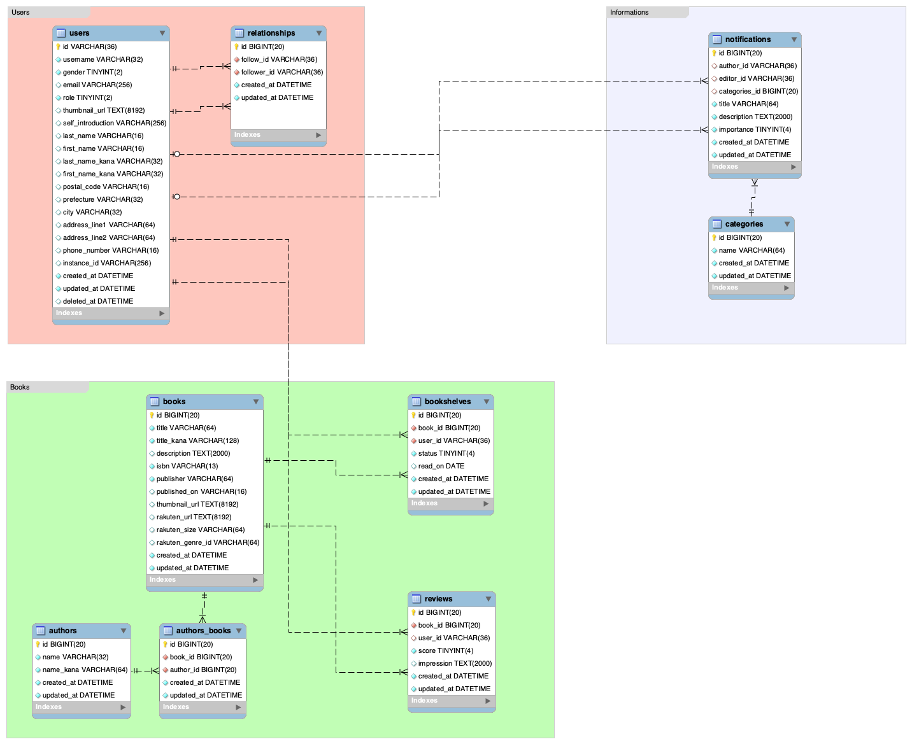
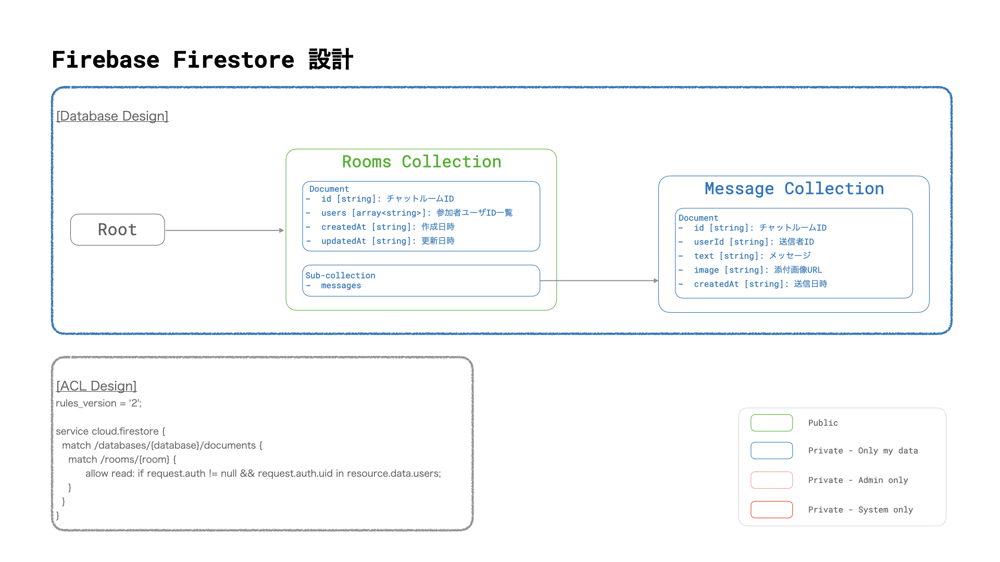

# データベース

[root](./../../README.md) 
/ [13_database](./README.md)

## 各種ドキュメント

* [RDB - 全体構成](./db_design.md)

* RDB
  * [ユーザー管理用DB](./01_user_db/README.md)
  * [書籍管理用DB](./02_book_db/README.md)
  * [ECサイト用DB](./03_store_db/README.md)
  * [お知らせ用DB](./04_notification_db/README.md)
* NoSQL
  * [認証用DB](./11_auth_db/README.md)
  * [チャット用DB](./12_chat_db/README.md)

## データベース設計

* RDB

* NoSQL

