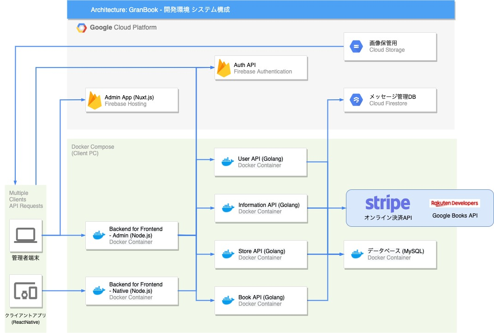
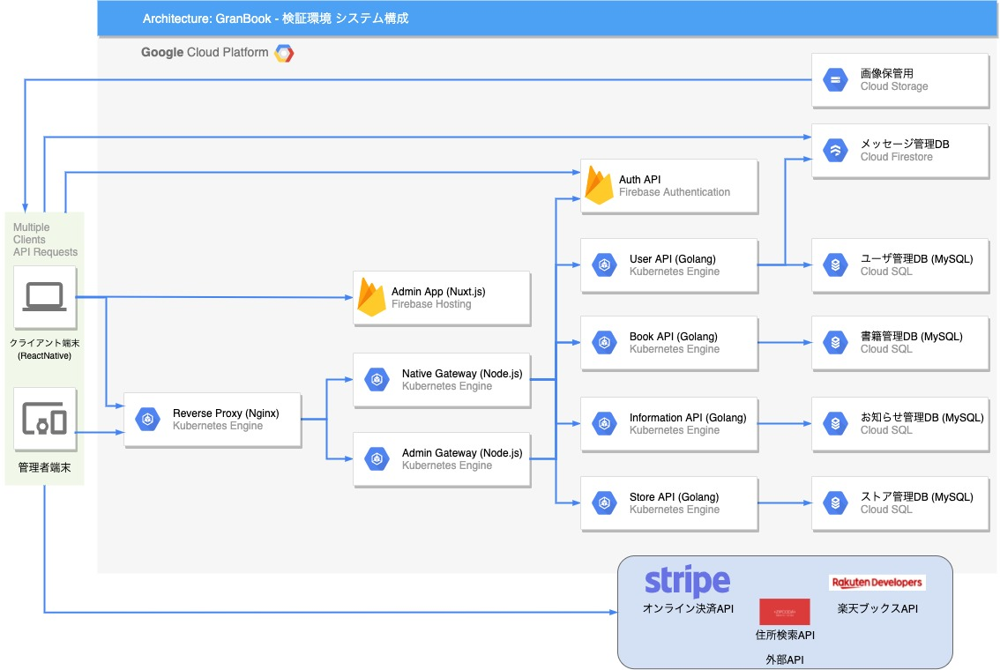

# インフラストラクチャ - GCP

[root](./../../../README.md) 
/ [14_infrastructure](./../README.md) 
/ [11_gcp](./README.md)

# 各種ドキュメント

## 開発環境

### 利用リソース

* Cloud Storage
* Docker
* Docker Compose
* Firebase Authentication
* Firebase Hosting
* Firestore
* Google Books API
* Stripe

### 構成概要図

---

## 検証環境

### 利用リソース

* Cloud CDN
* Cloud DNS
* Cloud Storage
* Cloud SQL for MySQL
* Firebase Authentication
* Firebase Hosting
* Firestore
* Google AdSense
* Google Analytics
* Google Books API
* Kubernetes Engine
* Stripe

### 概算見積もり

* ¥3,300/Month
* [Google Cloud Pricing Calculator](https://cloud.google.com/products/calculator/#id=c36aa795-f22a-4c0b-840f-26ef19072641)

### 構成概要図

